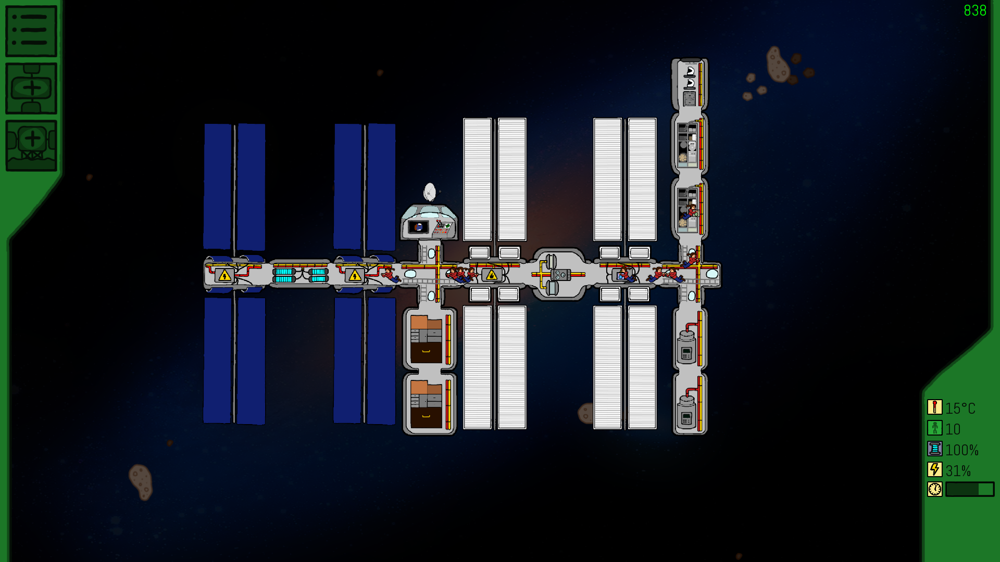

# [C++][SFML] Space-Hotel - Management game 2D

## Description du jeu

Ce jeu est actuellement en développement donc cette description est vouée à être modifiée.

Space-Hotel est un jeu de gestion d'une station spatiale. Vous partez d'une simple petite salle des commandes et devez construire votre station spatiale pour atteindre la survie, puis l'expansion, puis développer votre station en station touristique.
Pour l'instant, seul l'aspect création de salle et quelques aspects primaires de gestion sont implémentés et le développement est en pause car mes études ne me permettent pas de me lancer à fond dans ce projet, mais il est loin d'être mort, je continue d'ailleurs à la développer pendant les grandes vacances chaque année !

Voici une petite image du jeu:

